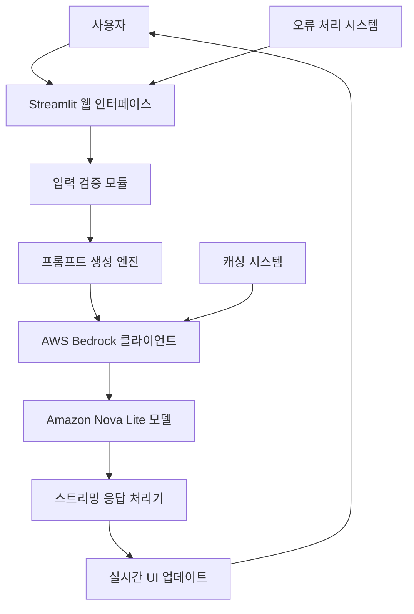
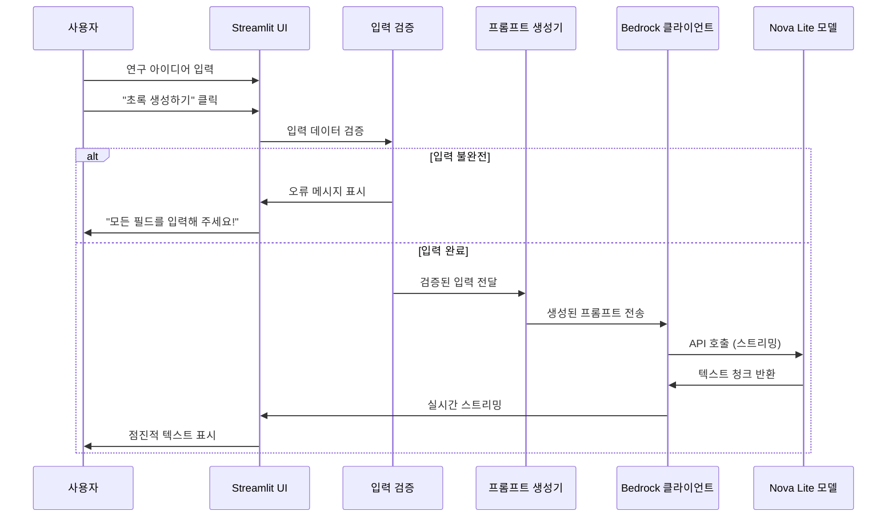

# 설계 문서

## 개요

AI 논문 초록 생성기는 Streamlit 기반의 웹 애플리케이션으로, AWS Bedrock의 Amazon Nova Lite 모델을 활용하여 연구자들의 캐주얼한 아이디어를 전문적인 학술 초록으로 변환합니다. 애플리케이션은 사용자 친화적인 한국어 인터페이스와 실시간 스트리밍 기능을 제공하여 직관적이고 매력적인 사용자 경험을 제공합니다.

## 아키텍처

### 전체 시스템 아키텍처



### 기술 스택

- **프론트엔드**: Streamlit (Python 웹 프레임워크)
- **AI 서비스**: AWS Bedrock (Amazon Nova Lite v1.0)
- **클라우드 서비스**: AWS (us-east-1 리전)
- **언어**: Python 3.x
- **의존성**: boto3, streamlit, botocore

## 컴포넌트 및 인터페이스

### 1. 사용자 인터페이스 컴포넌트

#### 1.1 메인 레이아웃 컴포넌트

```python
class MainLayout:
    - page_config: 와이드 레이아웃, 페이지 제목, 아이콘 설정
    - title_section: 앱 제목 및 부제목 표시
    - column_layout: 2열 레이아웃 (입력/출력)
```

#### 1.2 입력 폼 컴포넌트

```python
class InputForm:
    - research_topic: 연구 주제 입력 필드
    - research_background: 연구 배경 및 목적 텍스트 영역
    - methodology: 연구 방법 텍스트 영역
    - key_results: 핵심 결과 텍스트 영역
    - generate_button: 초록 생성 버튼
```

#### 1.3 결과 표시 컴포넌트

```python
class ResultDisplay:
    - progress_indicator: 생성 진행 상태 표시
    - streaming_output: 실시간 텍스트 스트리밍
    - final_abstract: 완성된 초록 표시
```

### 2. 백엔드 서비스 컴포넌트

#### 2.1 AWS Bedrock 클라이언트

```python
@st.cache_resource
def get_bedrock_client():
    """
    AWS Bedrock 클라이언트 초기화 및 캐싱
    - 리전: us-east-1
    - 서비스: bedrock-runtime
    - 캐싱: Streamlit cache_resource 데코레이터 사용
    """
```

#### 2.2 프롬프트 생성 엔진

```python
class PromptGenerator:
    def generate_academic_prompt(self, inputs: dict) -> str:
        """
        사용자 입력을 기반으로 AI 프롬프트 생성
        - 학술적 어조 변환 지시
        - 구조화된 초록 형식 요구
        - 200-250단어 길이 제한
        """
```

#### 2.3 스트리밍 응답 처리기

```python
def generate_abstract_response(prompt: str):
    """
    Bedrock API 스트리밍 응답 처리
    - 모델: amazon.nova-lite-v1:0
    - 설정: maxTokens=1024, temperature=0.7, topP=0.9
    - 실시간 텍스트 청크 반환
    """
```

### 3. 데이터 흐름



## 데이터 모델

### 입력 데이터 구조

```python
@dataclass
class ResearchInput:
    research_topic: str          # 연구 주제
    research_background: str     # 연구 배경 및 목적
    methodology: str            # 연구 방법
    key_results: str           # 핵심 결과 또는 예상 결과

    def validate(self) -> bool:
        """모든 필드가 비어있지 않은지 검증"""
        return all([
            self.research_topic.strip(),
            self.research_background.strip(),
            self.methodology.strip(),
            self.key_results.strip()
        ])
```

### API 요청/응답 구조

```python
# Bedrock API 요청 구조
bedrock_request = {
    "modelId": "amazon.nova-lite-v1:0",
    "messages": [
        {
            "role": "user",
            "content": [{"text": generated_prompt}]
        }
    ],
    "inferenceConfig": {
        "maxTokens": 1024,
        "temperature": 0.7,
        "topP": 0.9
    }
}

# 스트리밍 응답 구조
stream_chunk = {
    "contentBlockDelta": {
        "delta": {
            "text": "생성된 텍스트 청크"
        }
    }
}
```

## 오류 처리

### 오류 유형 및 처리 전략

#### 1. AWS 관련 오류

```python
try:
    # Bedrock API 호출
except ClientError as e:
    error_message = f"AWS 오류가 발생했습니다: {e.response['Error']['Message']}"
    st.error(error_message)
    # 로깅 및 사용자 친화적 메시지 표시
```

#### 2. 네트워크 및 일반 오류

```python
except Exception as e:
    error_message = f"오류가 발생했습니다: {e}"
    st.error(error_message)
    # 일반적인 오류 처리 및 복구 안내
```

#### 3. 입력 검증 오류

```python
if not all([research_topic, research_background, methodology, key_results]):
    st.error("❌ 모든 필드를 입력해 주세요!")
    return  # 처리 중단
```

### 오류 복구 메커니즘

1. **자동 재시도**: 일시적 네트워크 오류에 대한 자동 재시도 로직
2. **사용자 안내**: 명확한 한국어 오류 메시지와 해결 방법 제시
3. **상태 복원**: 오류 발생 시 사용자 입력 데이터 보존

## 테스트 전략

### 1. 단위 테스트

- **입력 검증 테스트**: 각 입력 필드의 유효성 검사
- **프롬프트 생성 테스트**: 다양한 입력에 대한 프롬프트 생성 검증
- **오류 처리 테스트**: 각 오류 시나리오에 대한 적절한 처리 확인

### 2. 통합 테스트

- **AWS Bedrock 연동 테스트**: API 호출 및 응답 처리 검증
- **스트리밍 기능 테스트**: 실시간 텍스트 스트리밍 동작 확인
- **UI 통합 테스트**: 전체 사용자 플로우 검증

### 3. 사용자 경험 테스트

- **한국어 입력 테스트**: 다양한 한국어 입력에 대한 처리 확인
- **응답 품질 테스트**: 생성된 초록의 학술적 품질 평가
- **성능 테스트**: 응답 시간 및 스트리밍 성능 측정

### 4. 보안 테스트

- **AWS 자격 증명 테스트**: 안전한 인증 처리 확인
- **입력 검증 테스트**: 악의적 입력에 대한 보안 검증
- **데이터 처리 테스트**: 사용자 데이터의 안전한 처리 확인

### 테스트 자동화 전략

```python
# 예시 테스트 구조
class TestAIAbstractGenerator:
    def test_input_validation(self):
        """입력 검증 로직 테스트"""

    def test_prompt_generation(self):
        """프롬프트 생성 테스트"""

    def test_bedrock_integration(self):
        """Bedrock API 통합 테스트"""

    def test_error_handling(self):
        """오류 처리 테스트"""

    def test_streaming_functionality(self):
        """스트리밍 기능 테스트"""
```

## 성능 고려사항

### 1. 응답 시간 최적화

- **클라이언트 캐싱**: `@st.cache_resource`를 통한 Bedrock 클라이언트 캐싱
- **스트리밍**: 전체 응답 대기 없이 점진적 결과 표시
- **비동기 처리**: 가능한 경우 비동기 처리 적용

### 2. 리소스 관리

- **메모리 효율성**: 대용량 텍스트 처리 시 메모리 사용량 최적화
- **연결 관리**: AWS 연결의 효율적 관리 및 재사용
- **세션 관리**: Streamlit 세션 상태의 효율적 활용

### 3. 확장성 고려사항

- **동시 사용자**: 다중 사용자 환경에서의 성능 유지
- **API 제한**: AWS Bedrock API 호출 제한 고려
- **캐싱 전략**: 반복적인 요청에 대한 캐싱 전략 수립
